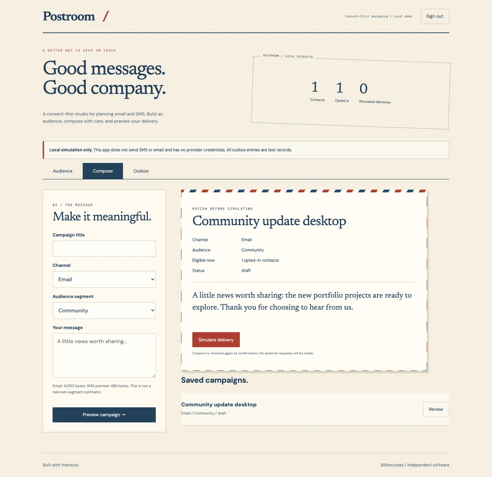

# Postroom / SMS & Email Gateway



A consent-first messaging studio with PHP 8.2+, PDO SQLite and responsive server-rendered HTML.

This is a new implementation of the former Bulk SMS Client App concept, not recovered source. It intentionally uses a local simulation instead of contacting SMS/email gateways. Nothing is sent, billed or delivered.

## Run

```sh
export APP_PASSWORD='choose-a-strong-workspace-password'
php -S 127.0.0.1:5103 -t public public/index.php
```

Open http://127.0.0.1:5103. Add example contacts with explicit per-channel consent, choose an audience segment, create a campaign, review eligible recipients and simulate delivery. The outbox labels every record as simulated.

## Test

```sh
php tests.php
```

Covers contact validation, duplicates, consent/channel/segment filtering, drafts, simulation idempotency, consent withdrawal and transaction rollback. No network requests occur in tests or app delivery.

## Privacy and deployment

- Session authentication, CSRF protection, SQLite login throttling, prepared statements and output escaping are built in.
- APP_PASSWORD (minimum 12 characters) must be set in the environment.
- DATABASE defaults to data/app.sqlite. It contains contact data and simulation history; back it up and restrict access.
- Serve only public/. Use PHP-FPM behind HTTPS and COOKIE_SECURE=true in production, not the built-in development server.
- Consent is checked again when a draft is confirmed. Opted-out contacts are excluded; deleting a contact does not delete existing local outbox history.
- No provider is configured. Adding real delivery would require provider credentials, verified sender identity, unsubscribe handling, suppression lists, shared rate limits and appropriate compliance review.
- SMS length is bounded by UTF-8 bytes; this demo does not calculate provider encoding or segment costs.
