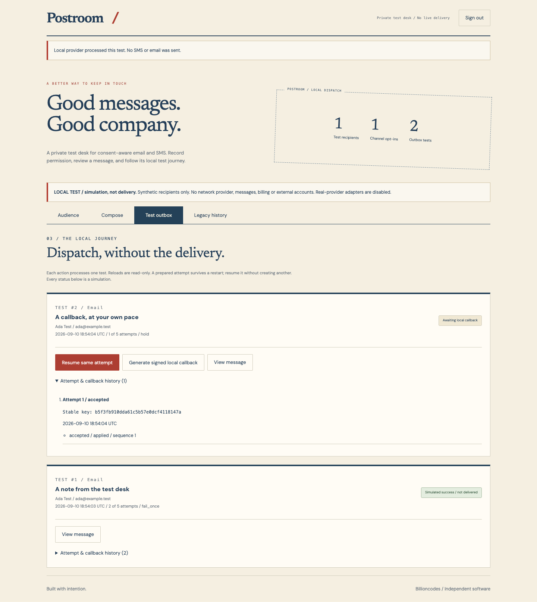
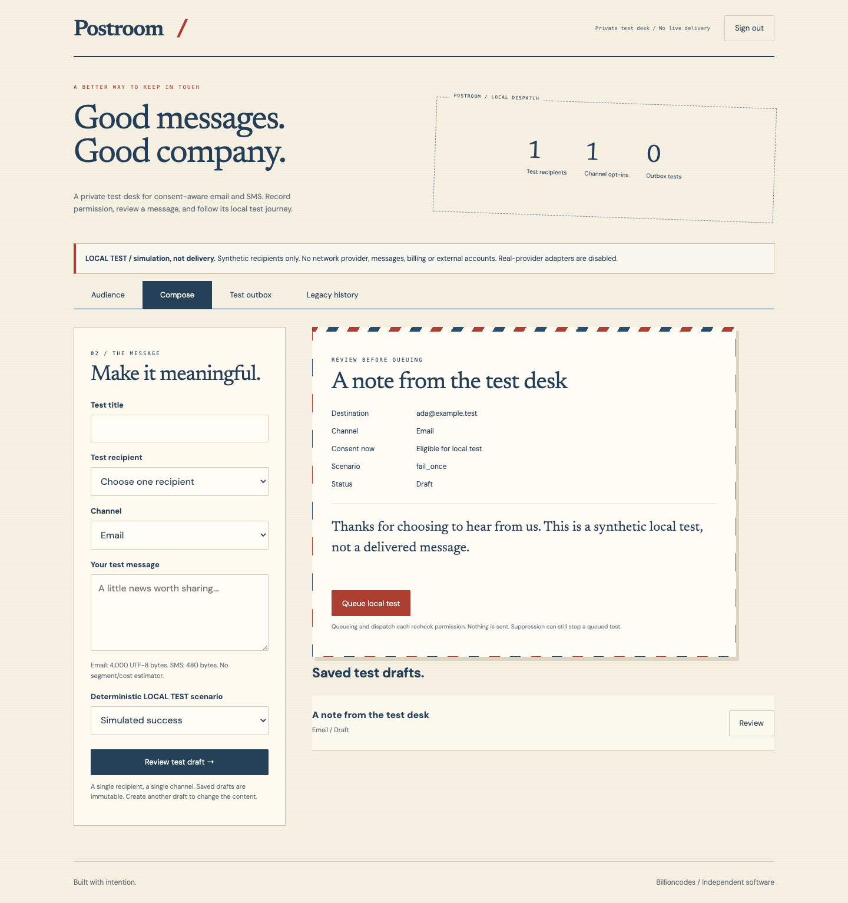

# Postroom / SMS & Email Gateway



A private, consent-aware **durable test outbox**, built with PHP 8.2+, PDO SQLite, mbstring and server-rendered HTML. The postal-stationery design, News/DM typography and local fonts are retained.

This is a new implementation of the former Bulk SMS Client App concept, not recovered source. **Simulation is not delivery.** There is no SMTP, SMS API, delivery SDK, external account connection or network call in the provider implementation. No live integration can be enabled by adding credentials.

## Run Locally

From this repository, enter your own password (at least 16 characters) when `read` waits for input. There is no default password. The callback secret below is generated locally, not a provider credential. Keep both environment values private and consistent across server/worker restarts.

```sh
read -r -s APP_PASSWORD
export APP_PASSWORD
export LOCAL_CALLBACK_SECRET="$(php -r 'echo bin2hex(random_bytes(32));')"
export APP_ORIGIN='http://127.0.0.1:5307'
export DATABASE="$PWD/data/local-tests.sqlite"
export POSTROOM_PROVIDER='local-test'
php -S 127.0.0.1:5307 -t public public/index.php
```

Open [Postroom on loopback](http://127.0.0.1:5307). The origin must match exactly; `localhost` and `127.0.0.1` are not interchangeable. Missing/short `APP_PASSWORD` locks all workspace data. A missing/short `LOCAL_CALLBACK_SECRET` permits draft work but locks dispatch. Only `local-test` is accepted as a provider. Bind only to loopback, not `0.0.0.0`; public/reverse-proxy hosting is intentionally unsupported.

`DATABASE` defaults to `data/app.sqlite` when unset. The example selects a separate test database so old demo data remains separate. Node is **not** required to run the PHP application.

## End-to-End Workflow

1. In **Audience**, add a synthetic recipient with one or both destinations. Allowed emails use `example.com`, `example.net`, `example.org` or `example.test`. SMS is restricted to `+12025550100` through `+12025550199`. No real personal data.
2. Check explicit opt-in separately for each channel and enter its evidence. An unchecked channel is not subscribed. Later opt-in also requires an explicit checkbox and evidence. These are operator declarations, not independently verified consent.
3. In **Compose**, choose one recipient, one channel and a deterministic test scenario. Save an immutable draft, review the destination/body/current permission, then **Queue local test**. No batch sends or bulk imports exist.
4. In **Test outbox**, dispatch that one test. `success` generates accepted + simulated-success callbacks; `fail_once` fails attempt 1 and succeeds after a deliberate retry; `always_fail` fails up to five attempts; `hold` waits for **Generate signed local callback**.
5. Use **Queue retry** only after failure, then dispatch the queued retry. Open attempt history to see stable IDs, callback ordering and ignored events. Reloading does not dispatch anything.
6. In **Audience**, record **Unsubscribe Email/SMS** or **Suppress all channels** with a reason. Channel suppression does not affect the other channel; global suppression affects both. Pending/failed tests are suppressed immediately. Permission is checked again when reserving an attempt and applying a callback.

Unsubscribe/suppression is permanent in this bounded pilot: no clearing, recipient deletion or re-add bypass. Historical successful simulations remain historical; suppression does not pretend to recall delivery. Already accepted local callbacks can be recorded in attempt history without reviving a suppressed message. There is no public recipient-facing unsubscribe link or inbound SMS STOP integration.



## Durability and Recovery

SQLite uses foreign keys, WAL, a 5-second busy timeout and `BEGIN IMMEDIATE` for domain writes. Recipient creation is atomic across both channels. Versioned consent/message forms reject stale pages. Durable operation receipts cover recipient creation, consent changes, drafts, queueing, retries and browser dispatch. Reusing a key with changed input is rejected; a delayed dispatch resolves its original attempt, never a later retry.

The message state machine is `draft -> queued -> submitted -> simulated | failed`, with `failed -> queued` for a deliberate retry. Revocation can move pending/failed messages to `suppressed`. Attempt states are `prepared -> accepted -> simulated | failed`; a terminal callback may arrive before acceptance. Sequence 1 is acceptance; sequence 2 is terminal. First terminal state wins. Old-attempt callbacks and older/conflicting states cannot rewind a message.

An attempt is committed **before** provider processing. If the process stops in between, restart with the same database and signing secret and use **Resume same attempt**. The deterministic provider regenerates the same event IDs. Callback replays cannot create attempts or duplicate transitions. Queued retries also survive restart.

For OS-trusted operator use, a one-shot CLI processes exactly one existing message with the same `DATABASE`, `POSTROOM_PROVIDER` and `LOCAL_CALLBACK_SECRET` environment. It does not run a scheduler and does not require a browser session:

```sh
php worker.php 1
php worker.php 1 --complete
```

Replace `1` with a saved message ID. `--complete` finishes a held local callback. The CLI advances the current attempt; browser dispatch additionally has per-form retry receipts. No automatic retry/backoff, daemon or recurring work is installed.

Old `contacts`, `campaigns` and `outbox` tables are preserved unchanged and shown only under authenticated **Legacy history**. New tables are prefixed `test_`. Old consent is not adopted and old simulations never enter the new outbox.

Backups are manual: stop the PHP server and all one-shot workers, then copy the entire database directory, including any `-wal`/`-shm` files, to protected storage. Restore into a separate directory with all processes stopped, point `DATABASE` at the copied SQLite file, then review queued/submitted tests before dispatch. Never copy just a live SQLite main file or replace an active database. There is no automated backup tool, encrypted storage, deletion/retention UI or verified restore assistant.

## Local Callback Contract

`POST /callbacks/local-test` is a loopback-only, signed endpoint, deliberately independent of browser authentication and CSRF. It accepts `Content-Type: application/json`, at most 2,048 body bytes, and exactly these fields:

```json
{"event_id":"unique-local-event-id","attempt_id":"32-lowercase-hex-characters","sequence":2,"state":"simulated"}
```

`attempt_id` must be a real saved **test** attempt ID. The string above is a schema illustration, not a valid attempt. Valid states are `accepted` (sequence 1), `simulated` or `failed` (sequence 2). No `delivered` state is accepted.

Send `X-Local-Timestamp` as ten-digit Unix seconds and `X-Local-Signature` as lowercase hexadecimal HMAC-SHA256 of `timestamp + "." + exact_raw_body`, using `LOCAL_CALLBACK_SECRET`. The timestamp must be within 300 seconds of server time. The signature uses constant-time comparison. Identical event-ID/body replays return `duplicate`; an event-ID/body conflict is rejected. A retry after the freshness window requires a fresh timestamp/signature over the same body. Store the secret outside source control. The browser never receives it.

The **Generate signed local callback** button invokes the same verifier internally without HTTP. Repository browser tests also exercise the real HTTP endpoint with valid, forged, expired and conflicting callbacks. Authentication/signing does not make this a real-provider integration.

## Verify

```sh
php tests.php
php tests/outbox.php
npm ci --ignore-scripts
PLAYWRIGHT_CHANNEL=chrome npm run test:e2e
```

Browser tests require Node 22+ and Chrome. Alternatively run `npx playwright install chromium` and omit `PLAYWRIGHT_CHANNEL`. Tests create random synthetic credentials and isolated temporary SQLite/session directories, run serially on **5307 (desktop) / 5308 (mobile)**, stop their servers and remove their fixtures. Leave those ports free; tests do not use or reset normal previews or `data/app.sqlite`.

Verified locally: original legacy regression suite, **18 durable-outbox test groups**, and **10 desktop/mobile browser cases**. Covers atomic rollback, duplicate requests, suppressed re-add, channel/global revocation, stale versions, provider fail-closed config, delayed dispatch, signed spoof/replay/out-of-order/old-attempt callbacks, retry caps, exact session expiry, password rotation, persistent recovery via two concurrent independent PHP workers, real browser workflows, WCAG A/AA automated checks and horizontal overflow. Automated accessibility checks are not a substitute for assistive-technology review. GitHub CI repeats these checks on pushes; consult the repository's run logs for remote results.

Actual screenshots are checked into `docs/`: `audience-desktop.png`, `audience-mobile.png`, `review-desktop.png`, `review-mobile.png`, `outbox-desktop.png`, `outbox-mobile.png`. To refresh from isolated fixtures:

```sh
PLAYWRIGHT_CHANNEL=chrome UPDATE_SCREENSHOTS=1 npm run test:e2e
```

[Mobile outbox](docs/outbox-mobile.png) / [Audience](docs/audience-desktop.png). The original `docs/preview.webp` is retained as historical material, not the current feature preview.

## Security and Limits

- A single-operator password gate protects every workspace page, including legacy data. Strict sessions rotate at sign-in/out, expire after at most eight hours and invalidate on password changes. Cookies are HttpOnly/SameSite=Lax. Local HTTP is not a public-hosting security model.
- Exact host/origin checks, loopback peer checks, CSRF tokens, atomic login throttling (10 attempts/minute), 32 KiB requests, CSP, escaped output and prepared statements are enforced. No forwarding headers are trusted. Only the public asset allowlist is served without authentication.
- Maximum 200 synthetic recipients, 500 immutable single-recipient messages, 5 attempts/message, 20 unique callback audit events/attempt and 10,000 operation receipts. Email bodies are limited to 4,000 UTF-8 bytes; SMS to 480 bytes. No encoding/segment/cost estimation. Limits fail closed rather than deleting history.
- Server validation retains compose/recipient fields in the rendered response. Unsaved forms are not durable across browser loss, expired sessions or network failures; only saved drafts/operation receipts are durable. There is no personal account system, role separation, password recovery or encrypted-at-rest data. Filesystem/database access is an OS-trusted operator boundary.
- No Twilio, SendGrid, SES, SMTP or other real-provider adapters are implemented. Live delivery requires a separately reviewed implementation, owner configuration, verified senders, owner-validated test recipients, appropriate consent/unsubscribe handling and real-provider signature/retry semantics. It remains disabled, not a placeholder claiming connectivity.
- No bulk outreach, public deployment, payment, tracking pixels, external analytics, contact sync, automatic jobs or live messages. This is a local engineering/test desk, not a production communications service or a compliance certification.
